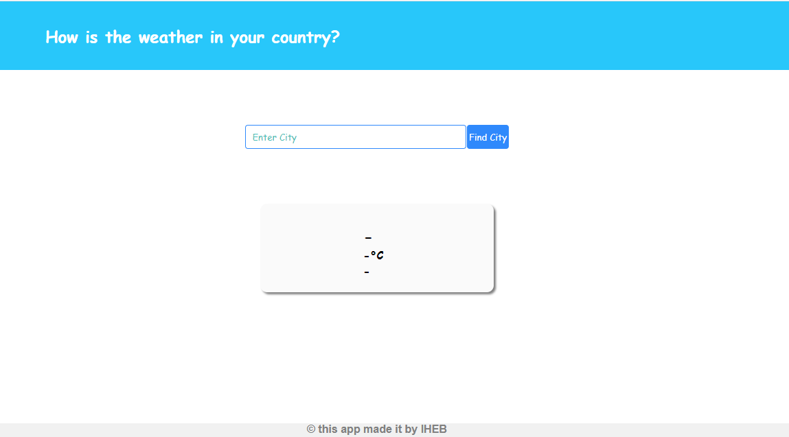
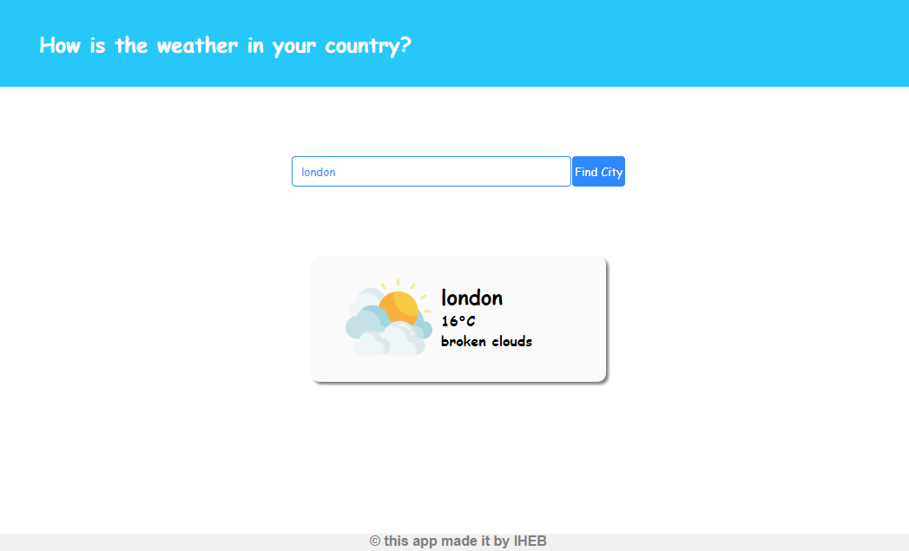
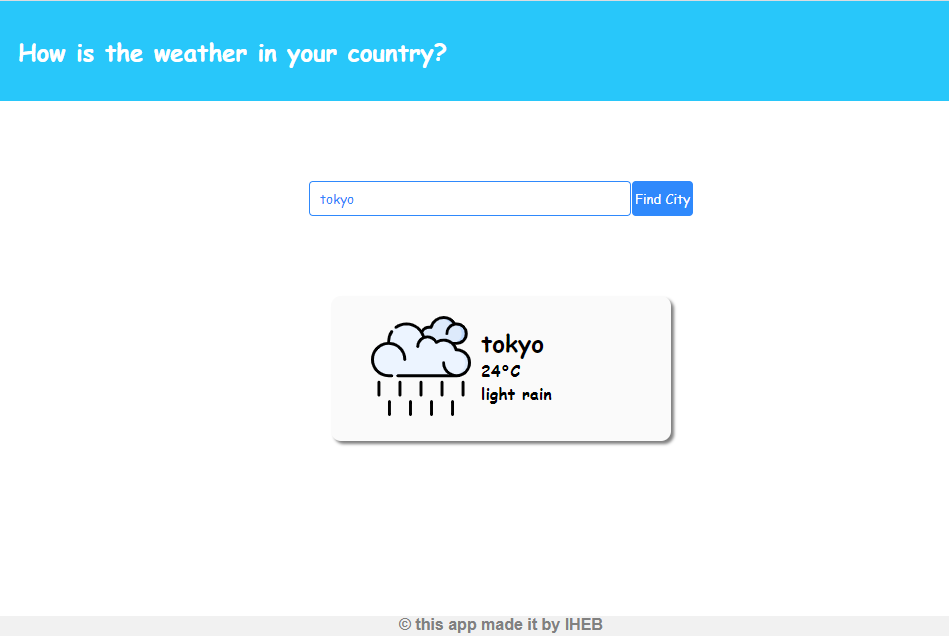

# app

## This application makes you know how the weather is in any country. Just enter "city name" in the search bar and then click the "Find" button. If no result appears, you must re-verify the city name.

###  After pull the project and before runnig the it, You must install all packages that the project needs.
  use -- npm install --
### To runnig the project.  
  use -- npm run serve --
### If you want to made some changes in the project you have to use "Prettier Formatter" because the project was initilized with it. If you use VSCODE or ATOM so you must to install the "Prettier" Extention in it.

## Weather Application

## Search

  
